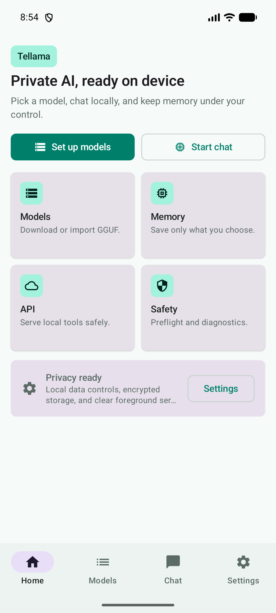
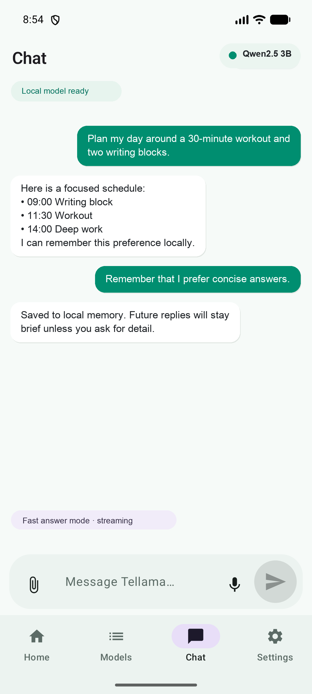
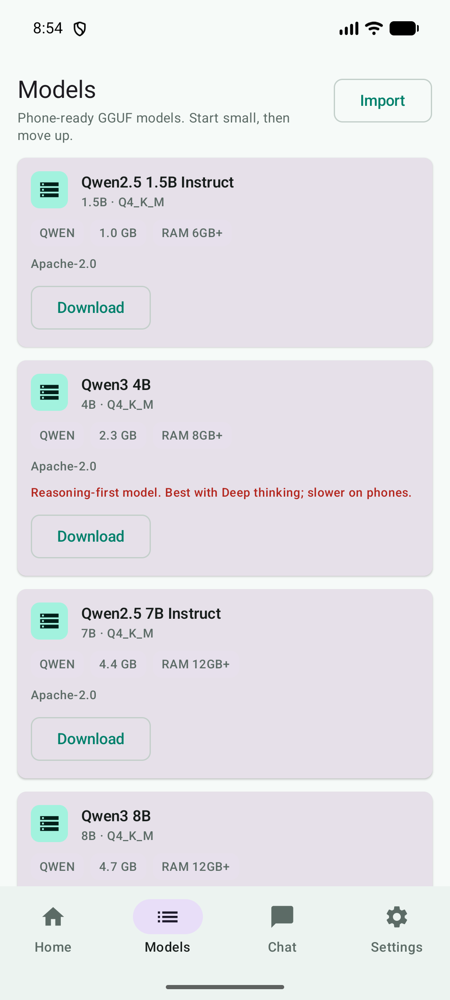
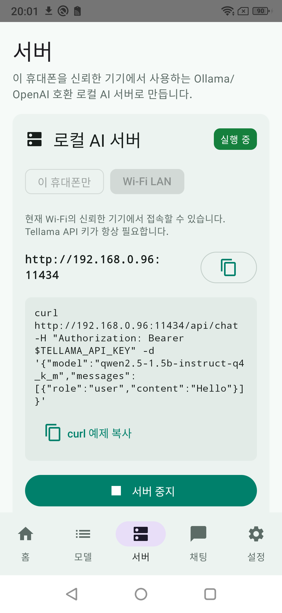

<p align="center">
  
</p>

<h1 align="center">Tellama</h1>

<p align="center">
  <strong>Turn your Android phone into a private, Ollama-compatible AI server.</strong><br />
  Run GGUF models on-device. Chat locally. Connect your PC, scripts, and agents through a small authenticated API.
</p>

<p align="center">
  <a href="https://github.com/redpluglab/tellama/releases/latest"><strong>Download the Android APK</strong></a>
  · <a href="docs/README.ko.md">한국어</a>
  · <a href="docs/API.md">API reference</a>
  · <a href="sdk/README.md">Open SDK</a>
  · <a href="https://redpluglab.github.io/tellama/privacy/">Privacy</a>
</p>

<p align="center">
  
  <a href="https://github.com/redpluglab/tellama/releases/tag/tellama-v1-1-8"></a>
  
  
  
</p>

## Your phone. Your model. Your endpoint.

<p align="center">
  
  
  
  
</p>

<p align="center">
  <sub><strong>Workspace</strong> · <strong>Local chat</strong> · <strong>Model library</strong> · <strong>Private API server</strong></sub>
</p>

Tellama is more than another chat screen. It turns hardware you already own into a reusable local AI endpoint:

- **Private by default:** compatible GGUF models, chats, and long-term memory stay on your device.
- **Useful beyond the phone:** trusted computers and agents can call Ollama- and OpenAI-compatible routes over your Wi-Fi.
- **Built for real devices:** model guidance, measured memory and thermal status, resumable downloads, and safe model unloading protect limited mobile resources.
- **Lightweight research agent:** summarize or compare public HTTPS pages with persistent sources, then choose whether the result belongs in long-term memory.

```text
Mac / PC / Agent  ── Ollama or OpenAI API ──▶  Android phone  ──▶  Local GGUF model
```

The Android app is commercially licensed and its complete source remains private. The working Python and JavaScript clients, examples, and compatibility tests in [`sdk/`](sdk/) are open source under Apache-2.0.

## Quick start

1. Install the [latest APK](https://github.com/redpluglab/tellama/releases/latest).
2. In **Models**, download and select a model that fits the phone.
3. In **Server**, create an API key, choose **Wi-Fi LAN**, and start the server.
4. Export the values shown by Tellama:

```bash
export TELLAMA_URL="http://PHONE_IP:11434"
export TELLAMA_API_KEY="tlm_..."
```

List the exact model IDs installed on the phone:

```bash
curl "$TELLAMA_URL/api/tags" \
  -H "Authorization: Bearer $TELLAMA_API_KEY"
```

Call the Ollama-compatible streaming chat route:

```bash
curl "$TELLAMA_URL/api/chat" \
  -H "Authorization: Bearer $TELLAMA_API_KEY" \
  -H "Content-Type: application/json" \
  -d '{
    "model": "MODEL_ID_FROM_API_TAGS",
    "messages": [{"role": "user", "content": "Hello from my Mac"}]
  }'
```

The response is newline-delimited JSON. OpenAI-style streaming is available at `POST /v1/chat/completions` using SSE. See the [API compatibility reference](docs/API.md) for the exact supported routes and current limitations.

## Open clients

No cloud account or package registry is required.

```bash
# Python 3.10+, standard library only
TELLAMA_URL="$TELLAMA_URL" TELLAMA_API_KEY="$TELLAMA_API_KEY" \
  python3 sdk/python/example.py

# JavaScript, Node.js 18+
TELLAMA_URL="$TELLAMA_URL" TELLAMA_API_KEY="$TELLAMA_API_KEY" \
  node sdk/javascript/example.mjs
```

The clients support model discovery, bounded generation options, Ollama NDJSON chat streaming, OpenAI SSE chat streaming, timeouts, and structured HTTP or stream errors. Run their contract suite with:

```bash
sdk/tests/run.sh
```

## What the Android app includes

- Phone-aware GGUF model catalog, import, selection, deletion, and per-model generation controls
- Resumable large-model downloads with storage reserve, trusted mirrors, SHA-256 checks, and GGUF validation
- Safe loaded-model deletion that stops active serving, unloads native memory, and then reclaims storage
- Local streaming chat with timestamps, slash commands, voice input, and user-controlled long-term memory
- User-initiated HTTPS page summaries and comparisons with persistent sources and explicit approval before saving a result to memory
- Workspace dashboard for serving readiness, measured chat speed, RAM, storage, battery, and thermal guidance
- Authenticated Wi-Fi LAN serving with one-time API keys, permission scopes, rate limiting, foreground status, and automatic stop on Wi-Fi loss
- In-app update download with SHA-256, package, version, and signing-certificate verification
- 15-language resources with TalkBack, large-text, landscape, tablet-width, and RTL layout support

## Security boundary

- LAN mode is off until the user starts it.
- LAN requests require `Authorization: Bearer <key>`.
- Full API keys are displayed once; Tellama stores their SHA-256 hashes.
- Changing or losing Wi-Fi automatically stops the LAN server.
- Do not expose port `11434` to the public internet or forward it from a router.
- External API models have different privacy and billing conditions from Tellama's local server.
- Web research makes direct HTTPS requests to the URLs you provide. Page text stays on the device when a local model is selected; with an external API model, that text is sent to the configured provider after an in-app warning.

Report security issues through [SECURITY.md](SECURITY.md). Feature requests and SDK contributions are welcome; see [CONTRIBUTING.md](CONTRIBUTING.md) and the [roadmap](docs/ROADMAP.md).

## Licensing

- Tellama Android application and brand assets: proprietary, all rights reserved.
- Public SDK, examples, and compatibility tests under `sdk/`: [Apache License 2.0](sdk/LICENSE).
- Downloaded models: governed by each model publisher's license.

This repository intentionally does not contain the Tellama Android application source, native runtime implementation, signing material, or internal configuration.
